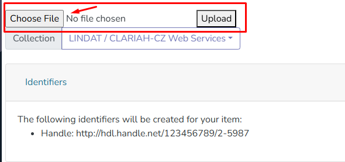
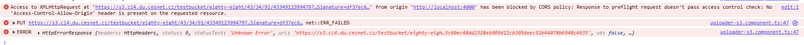

The CORS policies for the CESNET endpoint are set like this:
```aiignore
{
  "CORSRules": [
    {
      "AllowedOrigins": ["http://localhost:4000"],
      "AllowedMethods": ["PUT", "POST", "GET", "HEAD", "OPTIONS"],
      "AllowedHeaders": ["*"],
      "ExposeHeaders": ["ETag"],
      "MaxAgeSeconds": 3600
    }
  ]
}

```

How to replicate:
1. Start creating a new Item
2. Choose a file to upload  

3. Click upload

You should see this console error:
